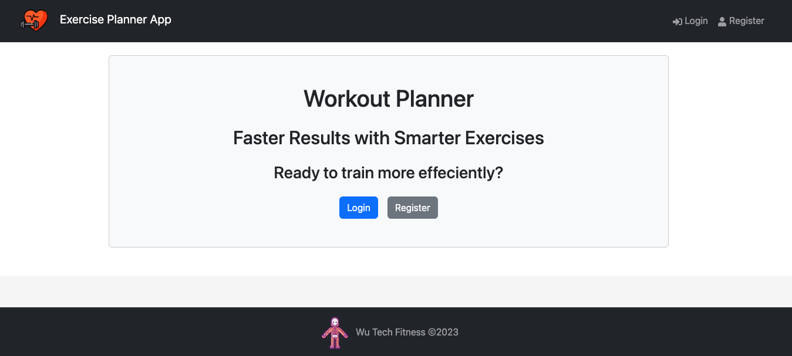
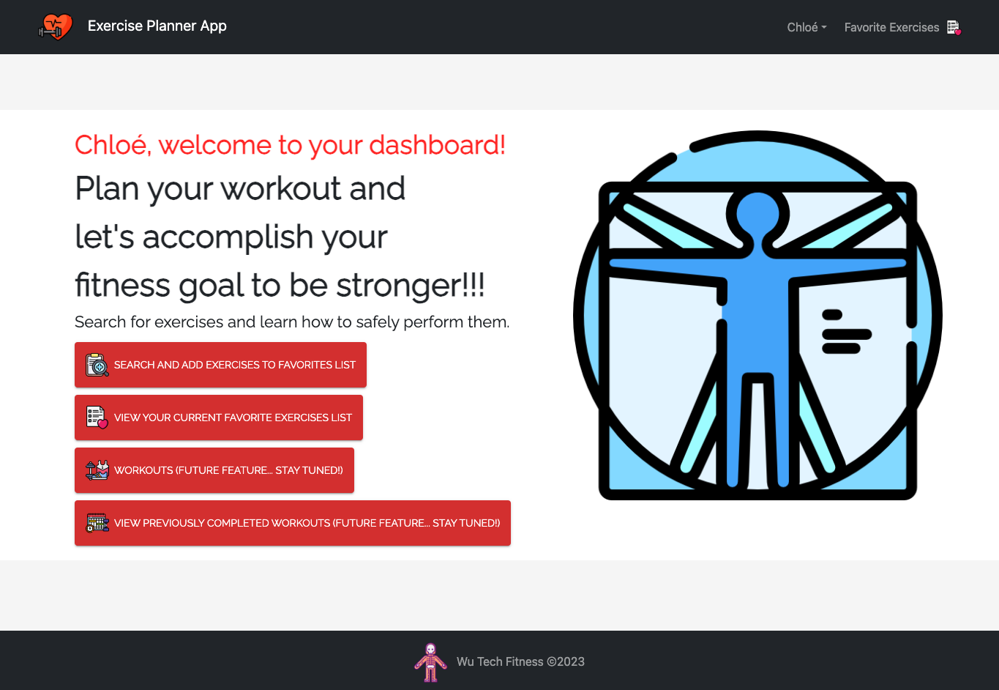
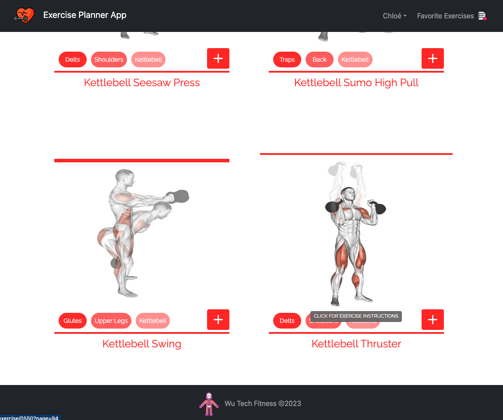
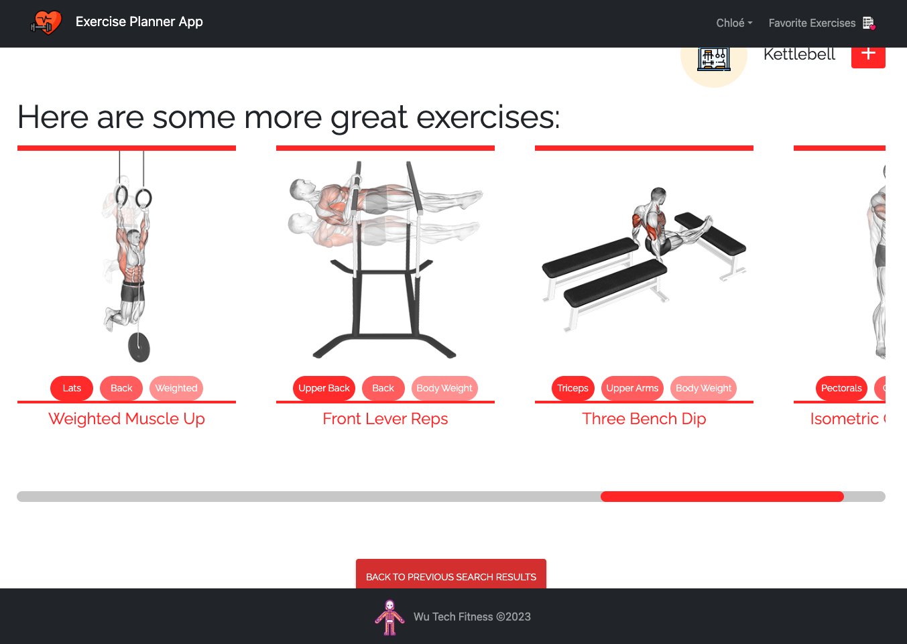
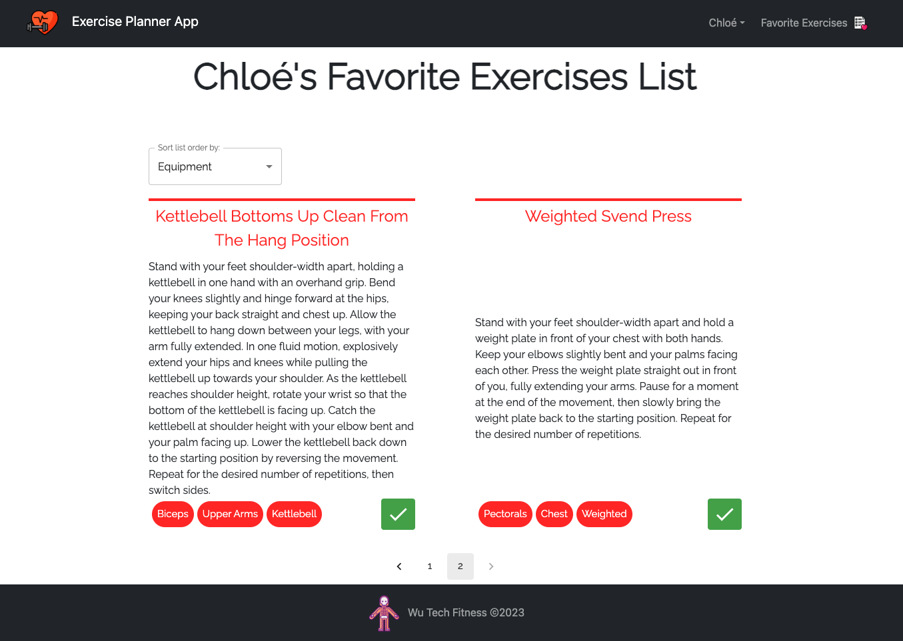
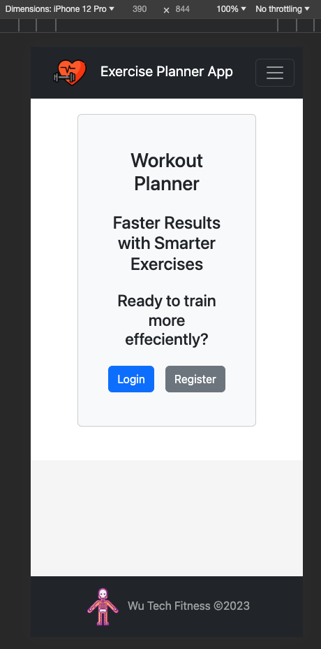
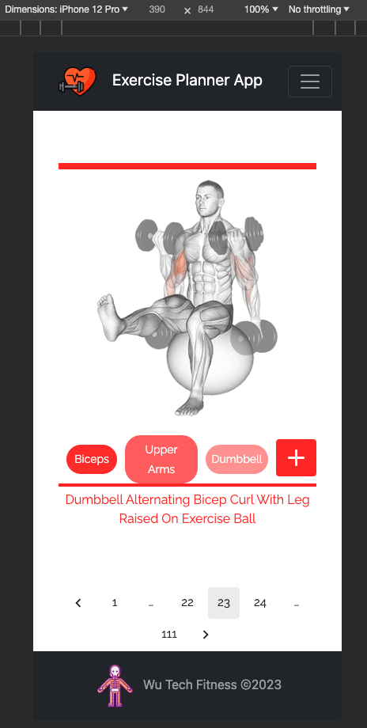
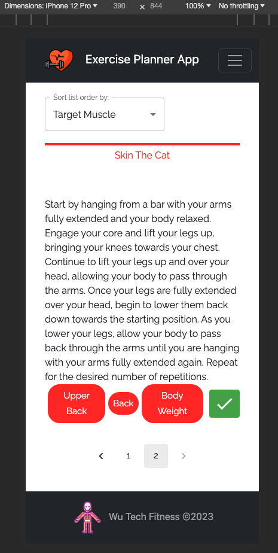

# Exercise Planner App

## Overview

The Exercise Planner App is a dynamic full-stack MERN web application with CRUD functionality designed to empower users on their fitness journey. Meticulously crafted with a passion for health and well-being, this app is the brainchild of a personal trainer and former firefighter, now venturing into the world of software engineering. This application provides a user-friendly interface for exploring a vast collection of exercises, curate a personal collection of favorites, and ultimately create personalized workout plans to elevate your fitness experience. This holistic application follows a client-server architecture, utilizing React on the client side and Express with MongoDB on the server side. The Exercise Planner App is your companion for achieving fitness goals with efficiency and enjoyment. Join us on this transformative lifestyle journey to a healthier and fitter you!

## Table of Contents

- [Features](#features)
- [Tech Stack](#tech-stack)
  - [Client Side](#client-side)
  - [Server Side](#server-side)
- [Getting Started](#getting-started)
  - [Installation](#installation)
- [Usage](#usage)
  - [Desktop View](#desktop)
  - [Mobile View](#mobile)
- [Deployment](#deployment)
- [License](#license)
- [Acknowledgments](#acknowledgments)

## Features

- **Explore Exercises:** Browse the comprehensive database of exercises with details such as muscle targets, equipment requirements, and step-by-step instructions.

- **Save Favorites:** Users can create an account, log in, and save their favorite exercises for quick and convenient access.

- **Sorting and Filtering:** Organize exercises based on various criteria such as name, body part, target muscle, and more.

- **Responsive Design:** The user interface is designed to be intuitive, ensuring a seamless experience across different devices and screen sizes.

## Tech Stack

### Client Side

- React
- Redux Toolkit for state management
- Material-UI for UI components
- React Router for navigation
- Bootstrap for styling
- React-Toastify
- Rapid API

### Server Side

- MongoDB with Mongoose for data storage
- Express.js
- NodeJS
- JWT for user authentication
- Bcrypt for password hashing

## Getting Started

### Installation

Running the Project Locally:

1. **Clone the Repository:**

   ```bash
   git clone https://github.com/Peter-JC-Wu/exercise-planner-app.git
   cd exercise-planner-app
   ```

2. **Install Dependencies:**

   ```bash
   npm install
   ```

3. **Set Up Environment Variables:**

   - Create a `.env` file in the root of the `exercise-planner-app` client and server folders.
   - Add the necessary environment variables, such as MongoDB connection string and JWT secret.

4. **Run the Application:**

   ```bash
   npm run dev
   ```

   This will start both the server and client applications concurrently.

   ```bash
   npm start
   ```

   This will start the server application separately.

   ```bash
   npm start
   ```

   This will start the client application separately.

5. **Access the App:**
   Open your browser and navigate to [http://localhost:3000](http://localhost:3000) to access the Exercise Planner App.

## Usage

### Desktop

Explore the user-friendly desktop interface:

- **Login/Register Page:**
  

- **Welcome Dashboard:**
  

- **Exercise Search Results:**
  

- **More Exercise Options at the Details Page:**
  

- **Favorites List:**
  

### Mobile

Explore the user-friendly mobile interface:

- **Login/Register Page:**

  

- **Exercise Search Results:**

  

- **Favorites List:**

  

## Deployment

- Render Link: [https://exercise-planner-app-client.onrender.com](https://exercise-planner-app-client.onrender.com)

## License

This project is licensed under the [ISC License](LICENSE).

## Acknowledgments

- Special thanks to friends, mentor [(Osama Tahir)](https://github.com/osamaahmed17), and [Parsity Online Code School](https://parsity.io/).
- Inspired by Rapid API [(ExerciseDB)](https://rapidapi.com/justin-WFnsXH_t6/api/exercisedb).
